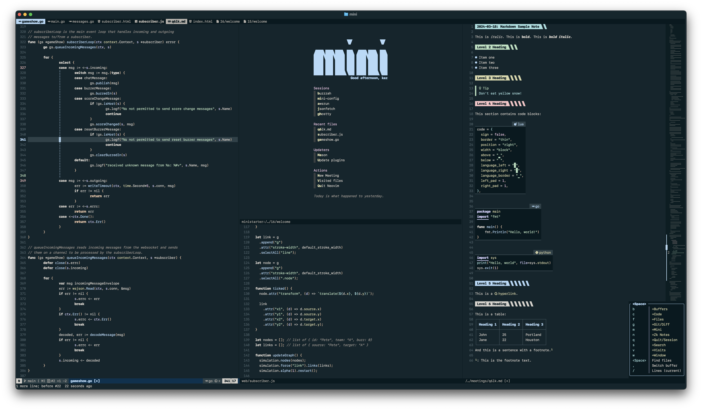

# Neovim Configuration

This configuration is designed for Neovim nightly. It uses `vim.pack` for
package management, which is scheduled to be included in Neovim 0.12+. In
addition, you'll notice that I'm a huge fan of `mini.nvim` and use it
extensively in my setup.



## Directory Structure

Key concepts:

1. Each plugin has its own configuration file. This makes it easier to
   navigate to a specific plugin's configuration via a file picker. It also
   results in smaller files that are easier to read and maintain.
2. Plugins are grouped into three subdirectories: core, mini, and other. Core
   contains essential configurations that I want to load first. Mini contains
   configurations for `mini.nvim` plugins. Other contains configurations for
   all other plugins.
3. Plugins are loaded in the order of core, mini, and other. Within each of
   those directories, plugins are loaded in alphabetical order as well, which
   is why they are prefixed with numbers to ensure the correct loading
   order.
4. Most mappings are defined in `plugin/core/12_mappings` so it's easy to see
   what mappings have been used and what's still available. In some cases,
   this is not possible, but for the most part, it works well.
5. Lazy loading is achieved using two helper functions from `mini.deps` called
   `now` and `later`. Any plugin this is essential for startup is loaded with
   `now`, while plugins that are not essential are loaded with `later`.

Below is an overview of the directory structure:

```txt
.
├── after                          # Sourced last (`:h after-directory`)
│   └── ftplugin/                  # Configurations for filetypes
├── colors/                        # Personal color schemes
├── init.lua                       # Main entry point
├── lsp/                           # LSP configurations
├── nvim-pack-lock.json            # Lockfile for `vim.pack`
├── plugin                         # Plugins loaded via `vim.pack`
│   ├── core                       # Core configurations
│   │   ├── 10_options.lua         # General options
│   │   ├── 11_autocommands.lua    # General autocommands
│   │   ├── 12_mappings.lua        # Key mappings
│   │   └── 13_functions.lua       # Custom functions
│   ├── mini/                      # Mini.nvim configurations
│   └── other/                     # Other plugin configurations
├── snippets/                      # Snippets for various filetypes
└── spell/                         # Spelling files

```

## Credits

My configuration is inspired by [echasnovski's](https://github.com/echasnovski/nvim).
