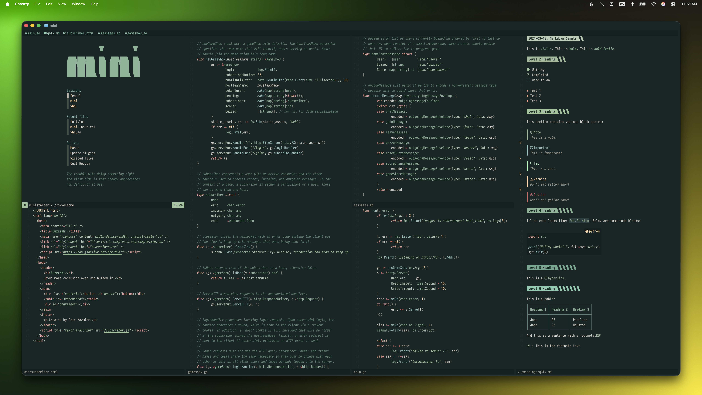

# Neovim Configuration

This is my personal Neovim configuration. It has been built around the
[mini.nvim][1] plugin---an amazing set of 40+ modules carefully crafted to
balance features versus implementation complexity.[^1]

The configuration is written in [Fennel][3], a lisp that compiles to Lua,
using [hotpot.nvim][4] as the compiler. Files are compiled ahead of time on
save and loaded transparently, so there is no compile cost at startup. The
only Lua in the tree is `init.lua`, which bootstraps hotpot itself.

> [!Note]
> This configuration is designed for Neovim **nightly**.



## Directory Structure

Key concepts:

- Each plugin has its own configuration module under `fnl/plugins/`. This
  makes it easy to navigate to a specific plugin's configuration via a file
  picker. It also results in smaller files that are easier to read and
  maintain.

- Load order is controlled by an **explicit manifest**
  (`fnl/config/init.fnl`): an ordered list of `require`s, split into three
  tiers. This replaces the old scheme of numeric filename prefixes in
  `plugin/` directories---ordering is now stated in one place instead of
  encoded in filenames.

- The three tiers: **now** (essential for first paint, runs synchronously at
  startup), **now-if-args** (runs synchronously when files/directories are
  opened directly, e.g. `nvim file.txt`, deferred otherwise), and **later**
  (deferred until after startup, order-free). Plugin modules pick their tier
  with the `with-now!` / `with-now-if-args!` / `with-later!` macros from
  `fnl/macros.fnlm`, which build on `MiniMisc.safely()` via
  `fnl/config/loader.fnl`.

- Most mappings are defined in `fnl/config/keymaps.fnl` so it's easy to see
  what mappings have been used and what's still available. Plugin-specific
  entry points (pickers, toggles, ...) are exported from their plugin module
  and invoked lazily from the keymaps.

- Plugins are managed natively by the new builtin 'vim.pack' plugin manager,
  which is scheduled for inclusion in Neovim 0.12+.

Below is an overview of the directory structure:

```txt
.
├── after                          # Sourced last (`:h after-directory`)
│   ├── ftplugin/                  # Configurations for filetypes (*.fnl)
│   └── syntax/                    # Syntax tweaks (orgagenda)
├── colors/                        # Personal color schemes (*.fnl)
├── flsproject.fnl                 # fennel-ls configuration
├── fnl                            # Fennel sources (compiled by hotpot)
│   ├── macros.fnlm                # Compile-time macros (set!, with-later!, ...)
│   ├── config                     # Foundations, loaded first
│   │   ├── init.fnl               # THE MANIFEST: ordered plugin load list
│   │   ├── options.fnl            # General options
│   │   ├── autocmds.fnl           # General autocommands
│   │   ├── functions.fnl          # Custom functions
│   │   ├── keymaps.fnl            # Key mappings
│   │   └── loader.fnl             # now/later helpers behind the with-* macros
│   └── plugins/                   # One module per plugin (mini and otherwise)
├── init.lua                       # Entry point: bootstraps hotpot, loads config
├── lsp/                           # LSP configurations (*.fnl)
├── nvim-pack-lock.json            # Lockfile for `vim.pack`
└── snippets/                      # Snippets for various filetypes
```

## Credits

My configuration is inspired by [echasnovski's](https://github.com/echasnovski/nvim).

[^1]:
    For those looking to explore this wonderful plugin, I highly recommend
    trying [MiniMax][2], which is a fully working self-contained Neovim
    configuration compatible with the current stable release of Neovim.

[1]: https://nvim-mini.org/mini.nvim/
[2]: https://nvim-mini.org/MiniMax/
[3]: https://fennel-lang.org/
[4]: https://github.com/rktjmp/hotpot.nvim
