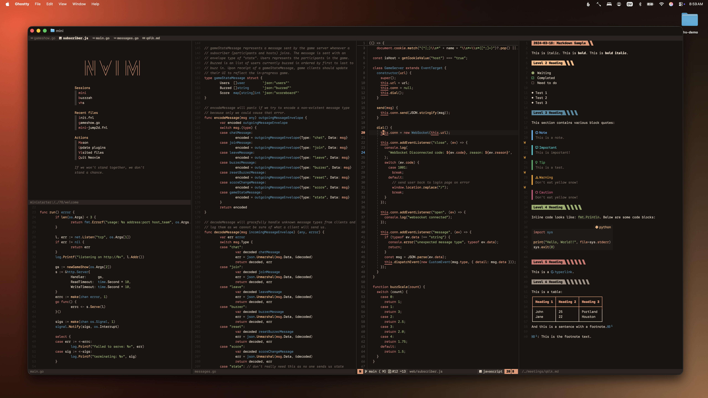

# Neovim Configuration

This is my personal Neovim configuration. It has been built around the
[mini.nvim][1] plugin---an amazing set of 40+ modules carefully crafted to
balance features versus implementation complexity.[^1]

> [!Note]
> This configuration is designed for Neovim **nightly**.



## Directory Structure

Key concepts:

- Each plugin has its own configuration module under `lua/plugins/`. This
  makes it easy to navigate to a specific plugin's configuration via a file
  picker. It also results in smaller files that are easier to read and
  maintain.

- Load order is controlled by an **explicit manifest**
  (`lua/config/init.lua`): an ordered list of `require`s, split into three
  tiers. This replaces my old scheme of using numeric filename prefixes in
  `plugin/` directories---ordering is now stated in one place instead of
  encoded in filenames.

- The three tiers: **now** (essential for first paint, runs synchronously at
  startup), **now_if_args** (runs synchronously when files/directories are
  opened directly, e.g. `nvim file.txt`, deferred otherwise), and **later**
  (deferred until after startup, order-free). Plugin modules pick their tier
  with `loader.now` / `loader.now_if_args` / `loader.later` from
  `lua/config/loader.lua`, which build on `MiniMisc.safely()`.

- Most mappings are defined in `lua/config/keymaps.lua` so it's easy to see
  what mappings have been used and what's still available. Plugin-specific
  entry points (pickers, toggles, ...) are exported from their plugin module
  and invoked lazily from the keymaps.

- Plugins are managed natively by the new builtin 'vim.pack' plugin manager,
  which is scheduled for inclusion in Neovim 0.12+.

Below is an overview of the directory structure:

```txt
.
├── after                          # Sourced last (`:h after-directory`)
│   ├── ftplugin/                  # Configurations for filetypes
│   └── syntax/                    # Syntax tweaks (orgagenda)
├── colors/                        # Personal color schemes
├── indent/                        # Indent rules (fennel)
├── init.lua                       # Entry point: bootstraps mini, loads config
├── lsp/                           # LSP configurations
├── lua
│   ├── config                     # Foundations, loaded first
│   │   ├── options.lua            # General options
│   │   ├── autocmds.lua           # General autocommands
│   │   ├── functions.lua          # Custom functions
│   │   ├── keymaps.lua            # Key mappings
│   │   └── loader.lua             # now/later deferred-loading helpers
│   └── plugins/                   # One module per plugin (mini and otherwise)
├── nvim-pack-lock.json            # Lockfile for `vim.pack`
└── snippets/                      # Snippets for various filetypes
```

[^1]:
    For those looking to explore this wonderful plugin, I highly recommend
    trying [MiniMax][2], which is a fully working self-contained Neovim
    configuration compatible with the current stable release of Neovim.

[1]: https://nvim-mini.org/mini.nvim/
[2]: https://nvim-mini.org/MiniMax/
